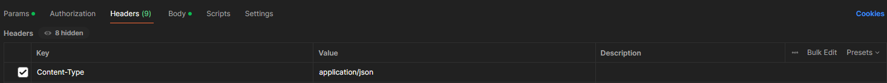
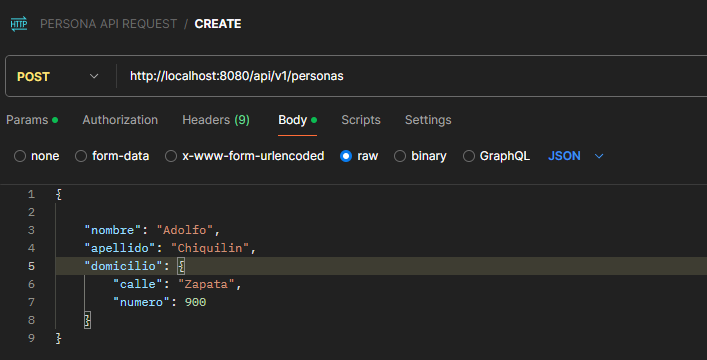
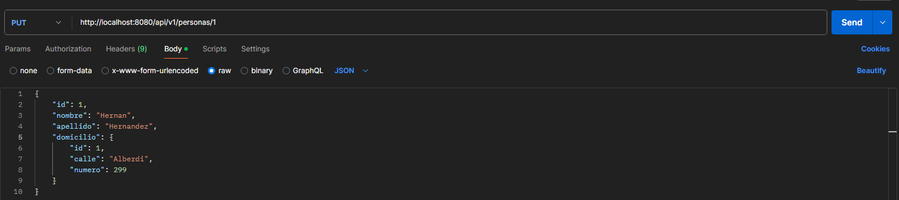
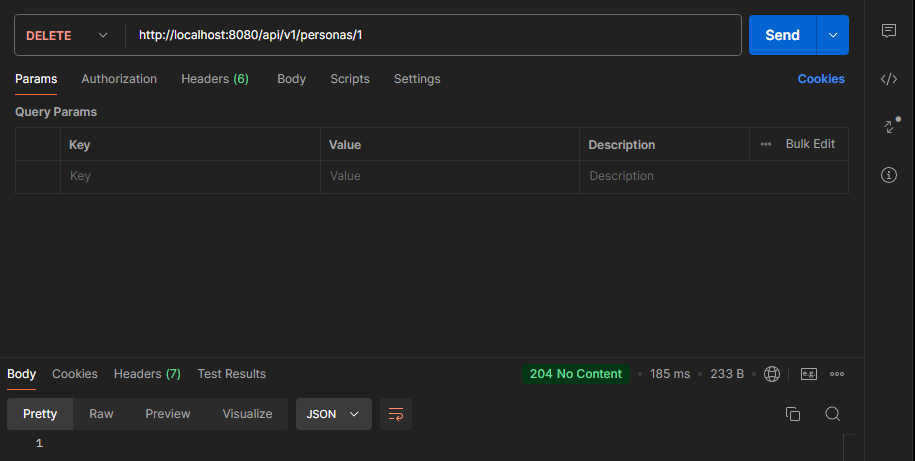

# API REST

En postman 

* GET ALL
http://localhost:8080/api/v1/personas

* GET ONE
http://localhost:8080/api/v1/personas/1 

(se le agrega el id al ultimo)

* CREATE

usamos el mismo url

pero en Header agregamos esto ->

En body nos queda una cosa así 

* UPDATE

el header de update queda igual que el de CREATE

* DELETE

aquí el delete, borramos la persona 1 jeje

